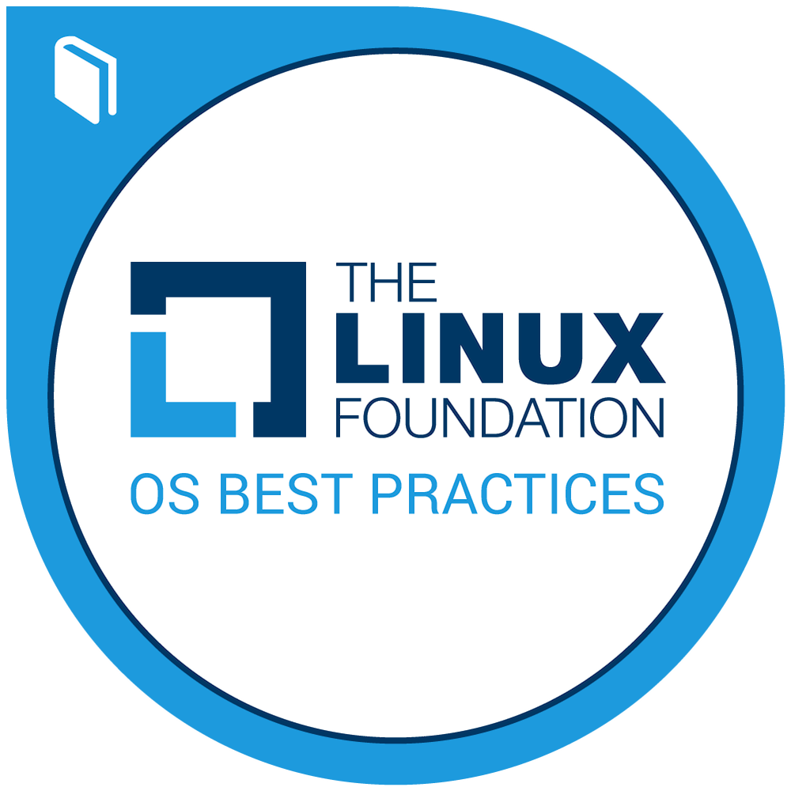

# Hi there, I am Shamal Lakshan Perera


<!-- 

[](https://github.com/ShamalLakshan?tab=repositories)


-->

<!-- <p></p>
<p> <a href="https://github.com/Shamal-Lakshan"></a> </p>
<p></p>
<p><a href="#"></a></p> -->


## Connect with me:

<!-- [][gmail-id]
[][linkedin-link]
[][twitter-link]
[][instagram-link]
[][reddit-link]
[][web-link]
[][blog-link] -->

```md
[Linkedin]: https://www.linkedin.com/in/shamallakshan/
[Personal-Web]: https://shamallakshan.me
[Blog]: https://blog.shamallakshan.me/
[Instagram]: https://www.instagram.com/j_m_s_l_p/
[Twitter]: https://twitter.com/JMShamalLakshan
[Wakatime]: https://wakatime.com/@ShamalLakshan
[StackOverflow]: https://stackoverflow.com/users/18888841/shamal-lakshan
[BuyMeACoffee]: https://www.buymeacoffee.com/shamallakshan
```


## Badges


<p>
  <a href="https://www.credly.com/badges/67814d4f-08f0-4e7a-ae01-69c472396914/public_url"></a>
  <a href="https://api.eu.badgr.io/public/assertions/GpXqhD8UQPWQhWsPczEBDg?identity__email=shamallakshan00600%40gmail.com"></a>
  <a href="https://www.credly.com/badges/9a0cc306-7874-4922-981d-284b4b6825c5/public_url"></a>
  <a href="https://www.credly.com/badges/efdf5b0a-df89-427f-9213-fa1b5df01f89/public_url"></a>
  <a href="https://catalog-education.oracle.com/pls/certview/sharebadge?id=E7E556BE2C1CD98D3F105391294D7677DE316AE0B474FCD12790B5BDC2B7FC10"></a>
<a href="https://www.credly.com/badges/9b439c45-1d1b-47c7-8157-abbdf9bda4a6/public_url"></a>
  <a href="https://www.credly.com/badges/21c7680b-cf42-482b-ba0f-dd312f97a86b/public_url"></a>
  
</p>

<!----
[](https://holopin.io/@shamallakshan)
--->
<!-- ---

<a href="https://www.buymeacoffee.com/shamallakshan" target="_blank"></a>

--- -->

[](https://wakatime.com/@018cc807-49ff-4917-b8f4-ef050abcdb27)

<!--
**Shamal-Lakshan/Shamal-Lakshan** is a ✨ _special_ ✨ repository because its `README.md` (this file) appears on your GitHub profile.

Here are some ideas to get you started:

- 🔭 I’m currently working on ...
- 🌱 I’m currently learning ...
- 👯 I’m looking to collaborate on ...
- 🤔 I’m looking for help with ...
- 💬 Ask me about ...
- 📫 How to reach me: ...
- 😄 Pronouns: ...
- ⚡ Fun fact: ...
-->
